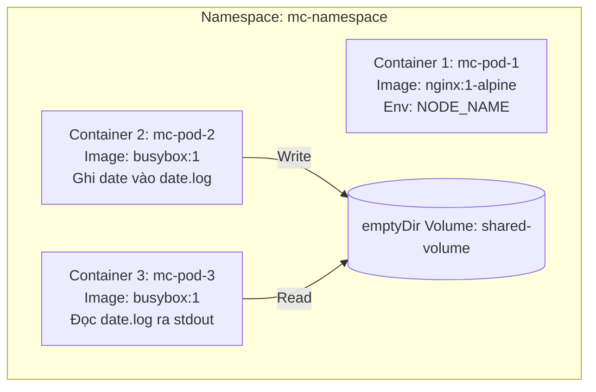

# Hướng dẫn CKA: Multi-Container Pod (Sidecar Pattern)

Tài liệu này được biên soạn ngắn gọn, hệ thống hóa toàn bộ luồng tư duy và các lệnh thực hành để bạn dễ tiếp thu nhất.

---

## 🎯 Bản đồ tư duy của bài toán (The Blueprint)

Mục tiêu là tạo **1 Pod** duy nhất chạy **3 Container** hoạt động như sau:



---

## 📄 File cấu hình hoàn chỉnh (`/tmp/mc-pod.yaml`)

Dưới đây là file YAML hoàn thiện. Bạn chỉ cần hiểu cấu trúc chia làm 3 phần chính: **Metadata chung**, **Các Container**, và **Ổ đĩa chia sẻ**.

```yaml
apiVersion: v1
kind: Pod
metadata:
  name: mc-pod
  namespace: mc-namespace # 1. Chạy trong namespace chỉ định
spec:
  # --- PHẦN 1: KHAI BÁO Ổ ĐĨA DÙNG CHUNG ---
  volumes:
  - name: shared-volume
    emptyDir: {}          # Ổ đĩa tạm, tự xóa khi Pod bị hủy

  # --- PHẦN 2: CÁC CONTAINER ---
  containers:
  
  # CONTAINER 1: Lấy thông tin Node Name
  - name: mc-pod-1
    image: nginx:1-alpine
    env:
    - name: NODE_NAME
      valueFrom:
        fieldRef:
          fieldPath: spec.nodeName # Lấy động tên Node chạy Pod

  # CONTAINER 2: Container ghi Log (Writer)
  - name: mc-pod-2
    image: busybox:1
    command: ["sh", "-c", "while true; do date >> /var/log/shared/date.log; sleep 1; done"]
    volumeMounts:
    - name: shared-volume
      mountPath: /var/log/shared # Gắn ổ đĩa chung vào thư mục ghi log

  # CONTAINER 3: Container đọc Log (Sidecar Reader)
  - name: mc-pod-3
    image: busybox:1
    command: ["sh", "-c", "tail -f /var/log/shared/date.log"]
    volumeMounts:
    - name: shared-volume
      mountPath: /var/log/shared # Gắn ổ đĩa chung vào thư mục đọc log
```

---

## 🏃 Quy trình thực hiện nhanh (Chỉ 2 Bước)

### Bước 1: Chuẩn bị môi trường & Tạo file cấu hình
Hãy copy toàn bộ khối lệnh `cat <<EOF` ở trên dán vào terminal để tạo nhanh file `/tmp/mc-pod.yaml`.

*Lưu ý: Nếu namespace chưa được tạo, chạy lệnh này trước:*
```bash
kubectl create namespace mc-namespace
```

### Bước 2: Apply cấu hình Pod
```bash
kubectl apply -f /tmp/mc-pod.yaml
```

---

## 🔍 Xác nhận kết quả thành công

Sau khi Pod chuyển sang trạng thái `Running`, chạy 2 lệnh sau để ăn trọn điểm:

1. **Xác nhận Container 1 nhận đúng tên Node:**
   ```bash
   kubectl exec -n mc-namespace mc-pod -c mc-pod-1 -- env | grep NODE_NAME
   # Kết quả đúng dạng: NODE_NAME=controlplane
   ```

2. **Xác nhận Container 3 (Sidecar) in được log ra stdout:**
   ```bash
   kubectl logs -n mc-namespace mc-pod -c mc-pod-3
   # Kết quả đúng: liên tục in ra các dòng thời gian thực
   ```
